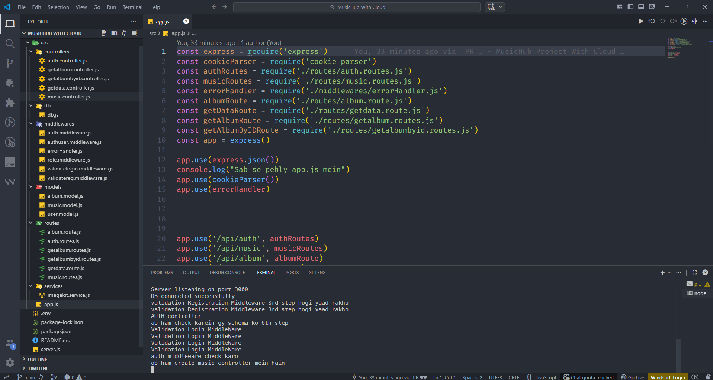
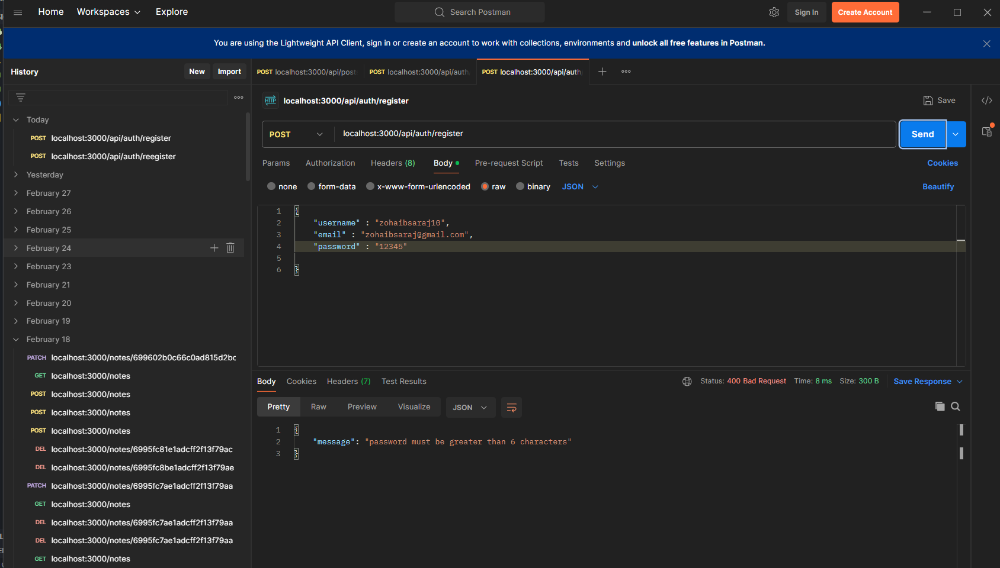
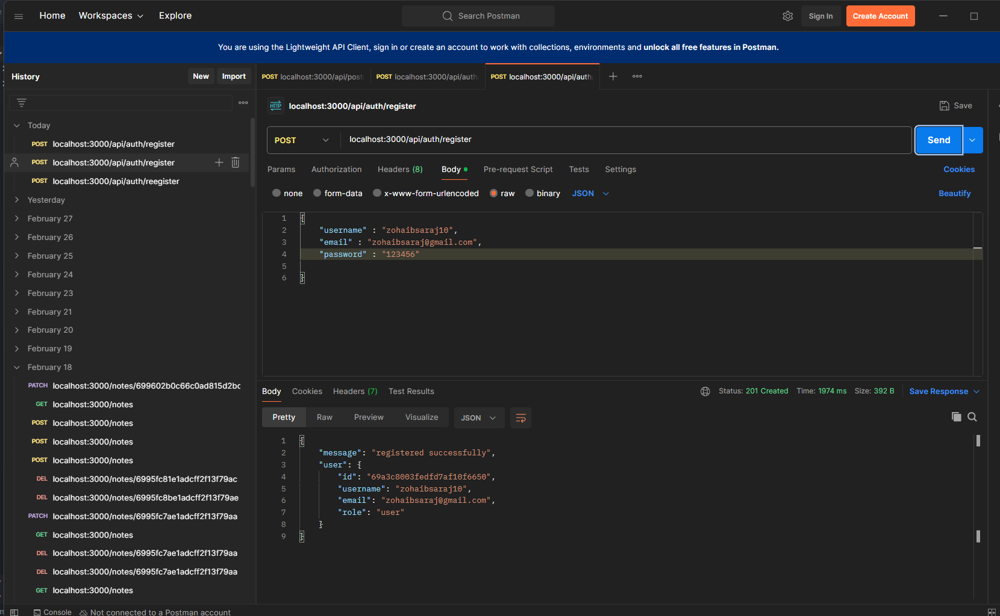
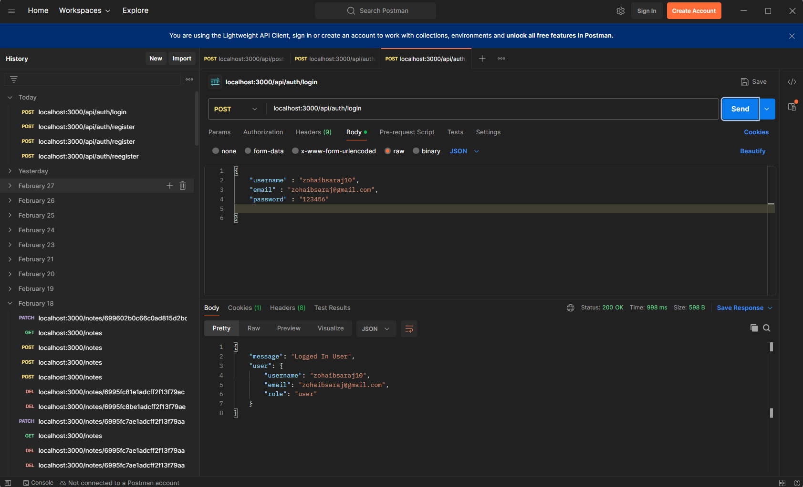
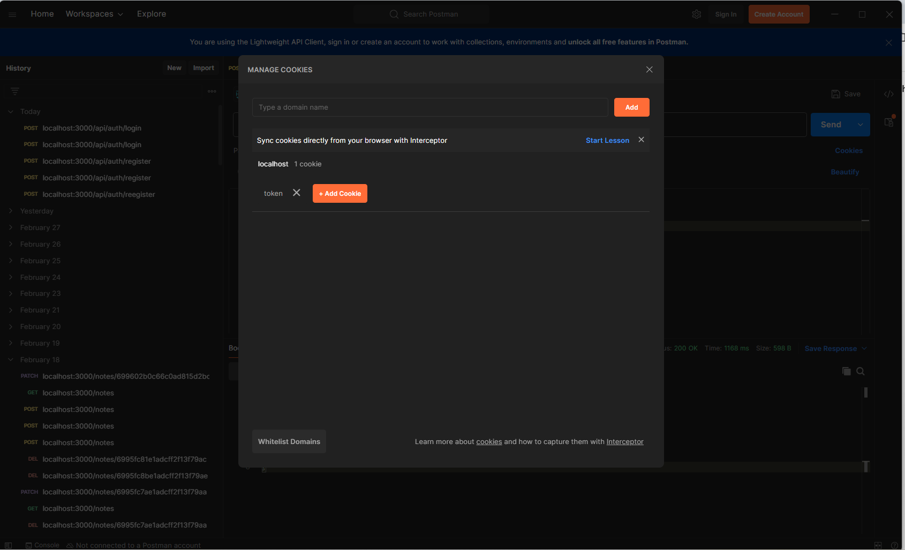
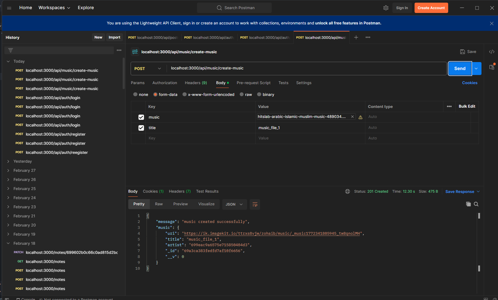

# 🎵 MusicHub with Cloud

MusicHub is a backend-focused capstone project inspired by a Spotify-like system. The main goal of this project is to demonstrate secure REST API development, authentication, role-based access control, ownership validation, and cloud-based media storage using ImageKit.

This project emphasizes backend architecture, clean flow handling, JWT authentication, bcrypt password security, and proper database modeling.

---

# 📁 Project Structure

Below is the clean folder structure of the project:



> Note: This project does not implement a complete enterprise-level feature-based architecture. Files are organized in a simplified structure for learning clarity. This is a capstone project focused on backend fundamentals rather than large-scale production architecture.

---

# 🔐 Authentication & Security Flow

## 0️⃣ Folder Structure 

Before Discussing, Project One view of Folder Structure.

![Folder Structure]
<p align="center">
  
</p>

---

## 1️⃣ Input Validation

Before processing, incoming data is validated.

![Input Validation]
<p align="center">
  
</p>

---

## 2️⃣ User Registration Flow

* Email/username duplicate check
* Password hashed using bcrypt
* User stored securely in MongoDB

![User Registration]
<p align="center">
  
</p>

---

## 3️⃣ User Login Flow

* Credentials verified
* Password compared using bcrypt
* JWT token generated upon successful login

![User Login]
<p align="center">
  
</p>
---

## 4️⃣ JWT Token Generation & Protection

* Token contains user ID and role
* Used to protect private routes
* Middleware verifies token
* Role-based access enforced

![JWT Protection] 
<p align="center">
  
</p>

---

## 5️⃣ Artist Role – Music Upload (Cloud Integration)

* Only users with "Artist" role can upload music
* Media uploaded to ImageKit Cloud
* ImageKit returns secure URL
* Metadata stored in MongoDB

![Artist Upload]
<p align="center">
  
</p>

---

## 6️⃣ Data Retrieval & Display

* Musics and albums fetched securely
* Ownership enforced
* One-to-many relationship handled (Album → Multiple Musics)

---

# 🧠 Backend Concepts Demonstrated

* RESTful API Design
* Middleware-based Architecture
* JWT Authentication & Authorization
* bcrypt Password Security
* Role-Based Access Control (RBAC)
* Input Validation vs Duplicate Checking
* Race Condition Awareness
* Ownership Enforcement
* MongoDB Schema Design
* One-to-Many Relationship Modeling
* Secure Cloud Storage Handling

---

# 🔄 Application Flow (High-Level)

Validation → Duplicate Check → Hash Password → Store User → Authenticate → Generate JWT → Authorize Role → Upload to ImageKit → Store Metadata → Fetch & Display Data

---

# 🗄 Tech Stack

* Node.js
* Express.js
* MongoDB (Mongoose)
* JSON Web Token (jsonwebtoken)
* bcrypt
* ImageKit Cloud

---

# 📦 Installation Guide

### 1️⃣ Clone Repository

```bash
git clone <repository-url>
cd MusicHub
```

### 2️⃣ Install Dependencies

```bash
npm install
```

### 3️⃣ Create Environment File (.env)

Add the following variables:

```
PORT=
MONGO_URI=
JWT_SECRET=
IMAGEKIT_PUBLIC_KEY=
IMAGEKIT_PRIVATE_KEY=
IMAGEKIT_URL_ENDPOINT=
```

### 4️⃣ Run Server

```bash
npm run dev
```

---

# 🔀 Contribution / Merge Guide

If you want to contribute:

```bash
git checkout -b feature-branch
git add .
git commit -m "Your message"
git push origin feature-branch
```

Then create a Pull Request.

---

# ⚠ Disclaimer

This is a capstone backend learning project. It is not a high-level production-ready system. Advanced production features such as refresh token rotation, advanced logging, rate limiting, monitoring, distributed caching, and fully modular feature-based architecture are intentionally simplified for educational clarity.

---

# 📂 Screenshot Folder Structure (Important)

Make sure your project directory looks like this:

MusicHub/
├── screenshots/
│    ├── file0.png
│    ├── file1.png
│    ├── file2.png
│    ├── file3.png
│    ├── file4.png
│    └── file5.png

Folder name must exactly match: `screenshots`
Otherwise GitHub will not render images.

---

# 📌 Summary

MusicHub demonstrates secure backend engineering practices including authentication, authorization, data modeling, role management, and cloud-based media handling. The focus is on building a strong backend foundation with real-world architectural awareness.

---

💡 Built with a learning mindset and strong backend engineering focus.
